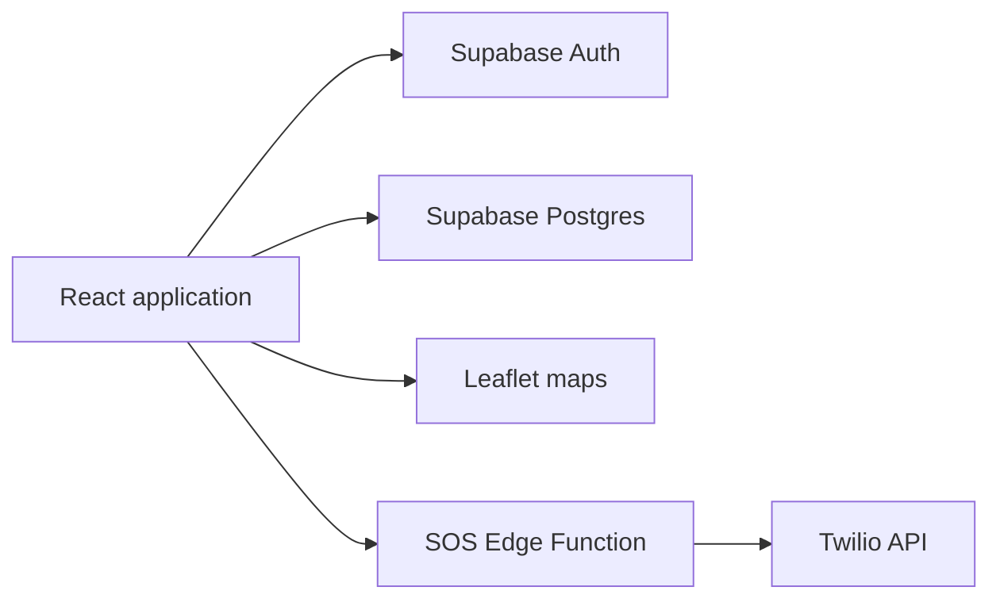

<div align="center">

<h1>🛡️ HerShield</h1>

<p><strong>A personal-safety companion for SOS alerts, trusted guardians, safer routes, and live trip sharing.</strong></p>

    

<p>
  <a href="#features">Features</a> •
  <a href="#technology-stack">Technology</a> •
  <a href="#local-setup">Setup</a> •
  <a href="#contributing">Contributing</a>
</p>

</div>

---

## Overview

HerShield is a responsive personal-safety web application that helps users trigger SOS workflows, manage trusted guardians, share live journeys, review incidents, and explore safer routes and nearby services. Supabase provides authentication and persistent data, while Leaflet powers location-aware maps.

> HerShield is a safety-support tool, not a replacement for emergency services. Always contact the appropriate local emergency number when immediate help is required.

## Features

- One-tap SOS experience with contact notifications
- Trusted guardian and emergency-contact management
- Live location sharing and trip tracking
- Safer-route and nearby-service views
- Incident reporting and history
- Safety score, fake-call, and voice-activation interfaces
- Authentication, onboarding, profile, and demo workflows
- Responsive navigation and accessible UI primitives
- Unit, component, and browser-test foundations

## Technology stack

| Area | Technology |
| --- | --- |
| Frontend | React 18 and TypeScript |
| Build | Vite and SWC |
| Routing | React Router |
| Server state | TanStack Query |
| Backend | Supabase Auth, Postgres, and Edge Functions |
| Maps | Leaflet and Leaflet Heat |
| UI | Tailwind CSS, shadcn/ui, Radix UI, Framer Motion |
| Validation | React Hook Form and Zod |
| Tests | Vitest, Testing Library, and Playwright |

## Architecture



## Routes

| Route | Purpose |
| --- | --- |
| `/splash` | Welcome and entry experience |
| `/auth` | Sign in and registration |
| `/onboarding` | Initial safety profile |
| `/` | Safety dashboard |
| `/sos` | Emergency workflow |
| `/routes` | Route exploration |
| `/guardians` | Trusted contacts |
| `/incidents` | Incident records |
| `/trips` | Journey history |
| `/live-tracking` | Active location sharing |
| `/profile` | Account and preferences |

## Repository structure

```text
src/
├── components/             # Product and reusable UI components
├── contexts/               # Authentication state
├── hooks/                  # Contacts, sharing, voice, and UI hooks
├── integrations/supabase/  # Client and generated types
├── pages/                  # Route-level screens
├── data/                   # Incident reference data
└── test/                   # Test setup
supabase/
├── functions/              # SOS notification function
└── migrations/             # Database schema changes
```

## Prerequisites

- Git
- Node.js 18 or newer
- npm 9 or newer
- A Supabase project
- Supabase CLI for local migrations and functions
- Twilio credentials if SMS delivery is enabled

## Local setup

### 1. Clone and install

```bash
git clone https://github.com/deepakvish001/safeherprojects.git HerShield
cd HerShield
npm install
```

### 2. Configure the browser app

```bash
cp .env.example .env
```

Set:

```env
VITE_SUPABASE_URL=https://your-project-ref.supabase.co
VITE_SUPABASE_PUBLISHABLE_KEY=your-anon-publishable-key
```

Only the public anonymous key belongs in Vite variables. Never expose the service-role key in browser code.

### 3. Prepare Supabase

Link your project and apply the committed migrations:

```bash
supabase login
supabase link --project-ref your-project-ref
supabase db push
```

For the SOS Edge Function, configure server-side secrets:

```bash
supabase secrets set \
  SUPABASE_SERVICE_ROLE_KEY=your-service-role-key \
  TWILIO_ACCOUNT_SID=your-account-sid \
  TWILIO_AUTH_TOKEN=your-auth-token
supabase functions deploy send-sos-sms
```

### 4. Run

```bash
npm run dev
```

Open the local URL printed by Vite.

## Quality commands

| Command | Purpose |
| --- | --- |
| `npm run lint` | Run ESLint |
| `npm test` | Run Vitest once |
| `npm run test:watch` | Run tests in watch mode |
| `npx playwright test` | Run browser tests |
| `npm run build` | Create a production build |
| `npm run preview` | Preview the build |

## Security and privacy

- Treat precise location, phone numbers, and incident details as sensitive.
- Enable Row Level Security for every user-owned table.
- Keep Twilio and service-role credentials inside Edge Function secrets.
- Require authorization before reading contacts, trips, SOS events, or profiles.
- Define explicit data-retention and deletion policies.
- Avoid promising emergency delivery until provider failures and retries are monitored.

## Contributing

Keep pull requests focused, add tests for critical SOS and authorization paths, and document schema or environment changes. Run lint, tests, and a production build before requesting review.
